# API Hook & DLL注入 相结合---针对notepad的实验

### 基础知识 
* DLL 注入+ API hook技术实现对软件行为的篡改，是实现文件或者进程隐藏，外挂等的基础技术。
* IAT hook 是API hook的一种，API hook是通过修改函数的地址从而达到篡改程序行为的一种技术。
* IAT hook 原理理解：
  * IAT : 导入地址表
  * 导入表的位置是固定的，但是表里面的值是变的
  * 每次运行之前都要把指针的值搞定
  * 可理解为信箱是导入表，目的函数的地址从约定好的信箱获取，黑客可以结构PE文件，找到对应信箱，修改信箱中的内容，替换原本存在的真实系统函数的地址，使得系统调用了一个假函数。

### 实验过程
#### （一）用IAT hook技术替换WriteFile()函数
* 目的：使用IAT hook技术将txt文件中的所有“呵呵”替换成“哈哈”
* 主函数wmain的代码逻辑：    
  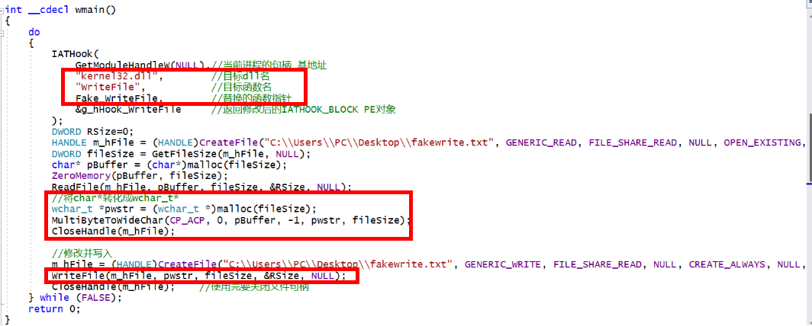  
  * IATHook()函数实现：找到导入表中kernel32.dll的WriteFile函数对应的位置，将地址用自己编写的Fake_WriteFile函数地址替换，这样当程序调用kernel32.dll的WriteFile函数时，其实是调用的Fake_WriteFile
    * 反汇编观察地址变化
      * 在没有执行IATHook函数的时候，调用WriteFile函数时，通过反汇编可看到call函数目的地址存在dword ptr ds:[00B9B010h] 内存位置，查看内存，发现地址是0x775d4320      
      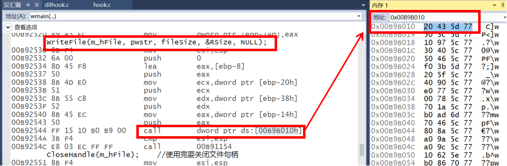  
      * 执行IATHook函数之后，发现该内存位置存储的地址发生了改变，变为了0x00B910a5       
      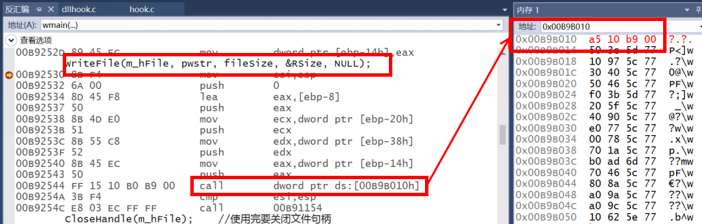
      * 我们也可以看到0x00B910a5位置处确实是jmp到Fake_WriteFile函数的语句，所以IAT Hook成功！   
      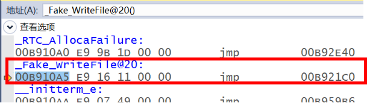    
  * 然后用ReadFile函数读入fakewrite.txt文件，将文件中的内容用MultiByteToWideChar转化成宽字节的Unicode编码格式，方便处理中文字符
  * 将读入的信息再次用WriteFile函数写回fakewrite.txt文件，此时的WriteFile函数调用的是Fake_WriteFile函数，该函数代码如下   
    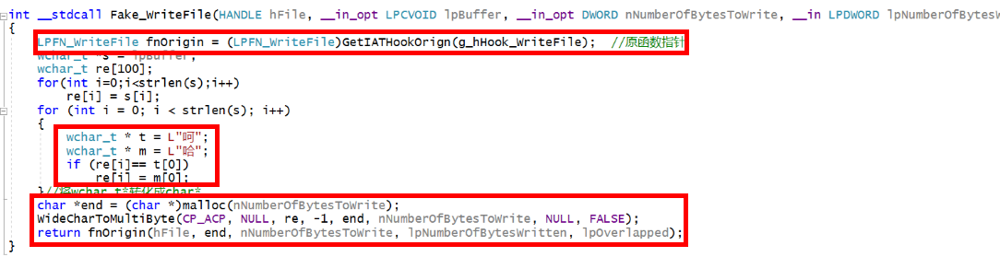   
    * 要获取原WriteFile函数的指针 
    * 将字符串中所有的“呵”字都用“哈”字替换（注意是宽字符格式）
    * 将修改后的宽字符串用WideCharToMultiByte转化成ANSI或者UTF8编码格式（根据notepad的编码格式不同而不同）
    * 调用原函数将修改后的字符串写入fakewrite.txt文件
  * 运行此程序可以观察到：
    * 原来fakewrite.txt写入的内容是“把所有的呵呵呵呵呵都替换成哈”    
      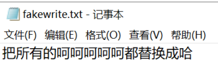
    * 运行程序后，再打开fakewrite.txt，发现内容变成了“把所有的哈哈哈哈哈都替换成哈”    
      替换成功   
      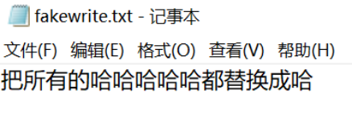 

#### （二）把IAT hook的代码包装成dll文件
* 在hook.c文件中添加DLLMain函数，在DLL_PROCESS_ATTACH情况下调用以上的wmain函数       
  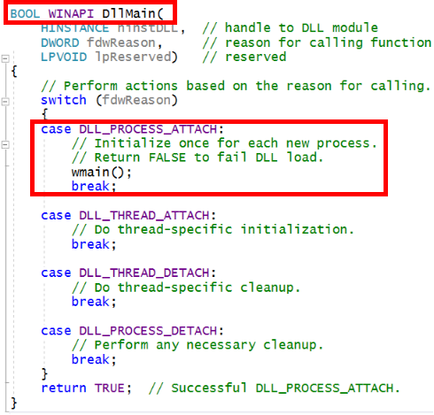    
* 添加exp.def文件，添加要导出的函数wmain      
  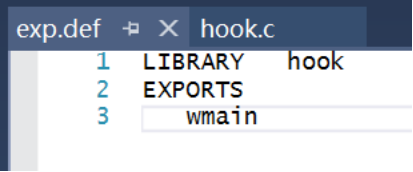     
* 修改项目配置属性     
  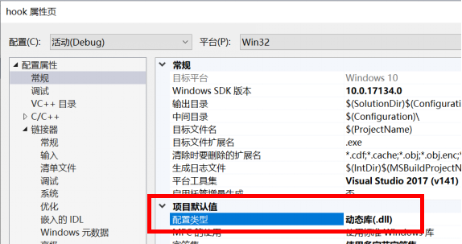       
  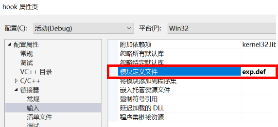       
  * 生成hook.dll文件  
  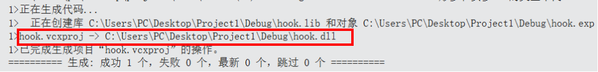      

### 将该dll文件注入目标notepad.exe  
* 和第六次作业的DLL注入过程一致，详情解释看[第六次作业实验报告](https://github.com/DXY0411/SoftwareDevelopment/tree/master/%E5%AE%9E%E9%AA%8C%E4%BA%94-%E7%BC%96%E5%86%99DLL%E3%80%81Load-Time%E4%B8%8ERun-time%E5%8A%A8%E6%80%81%E9%93%BE%E6%8E%A5%E5%AE%9E%E9%AA%8C)
* 整合进程遍历的程序，使得攻击程序可以自己遍历进程得到目标程序的pid ，进行我们编写的hook.dll的注入   
  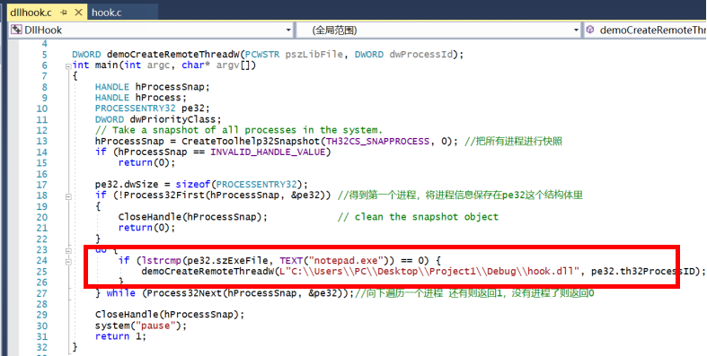 
* 实验步骤 
  * 打开32位的notepad.exe，向其中写入“替换呵呵呵呵呵呵呵呵” 并保存为fakewrite.txt文件（编码方式要和之前的代码中字符串所用编码方式匹配）   
    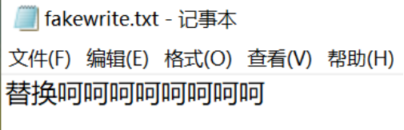
  * 不要关闭这个fakewrite.txt文件  
  * 直接运行dll注入程序，显示注入成功。    
    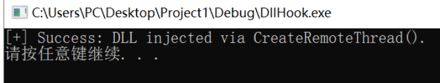   
  * 关闭 fakewrite.txt 文件  
  * 重新打开该文件  
  * 观察到确实替换成功为“替换哈哈哈哈哈哈哈哈”    
    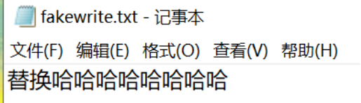
  * 实验成功！
  
### 参考文献
* tinysec/iathook https://github.com/tinysec/iathook
* CreateRemoteThread function https://docs.microsoft.com/zh-cn/windows/win32/api/processthreadsapi/nf-processthreadsapi-createremotethread?redirectedfrom=MSDN
* 字符编码转换 https://blog.csdn.net/bigapple88/article/details/6002121