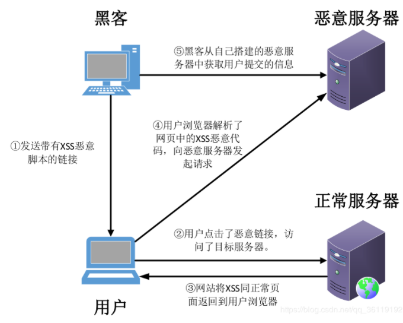
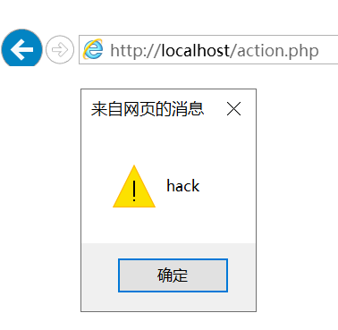

# XSS攻击实验

## 基础知识
* 跨站脚本攻击XSS(Cross Site Scripting)，为了不和层叠样式表(Cascading Style Sheets, CSS)的缩写混淆，故将跨站脚本攻击缩写为XSS。恶意攻击者往Web页面里插入恶意Script代码，当用户浏览该页面时，嵌入Web里面的Script代码会被执行，从而达到恶意攻击用户的目的。
* 反射型XSS：非持久化，需要欺骗用户自己去点击链接才能触发XSS代码（服务器中没有这样的页面和内容），一般容易出现在搜索页面。反射型XSS大多数是用来盗取用户的Cookie信息。
  

## 实验环境
* 安装好Apache和php

## 实验
* 最基本的反射型的XSS漏洞，这种漏洞数据流向是： 前端-->后端-->前端
  * 前端：    
    
  * 后端：     
    
  * 在前段表单中填写“”，提交到后端     
    
  * 前端弹框，攻击成功     
    