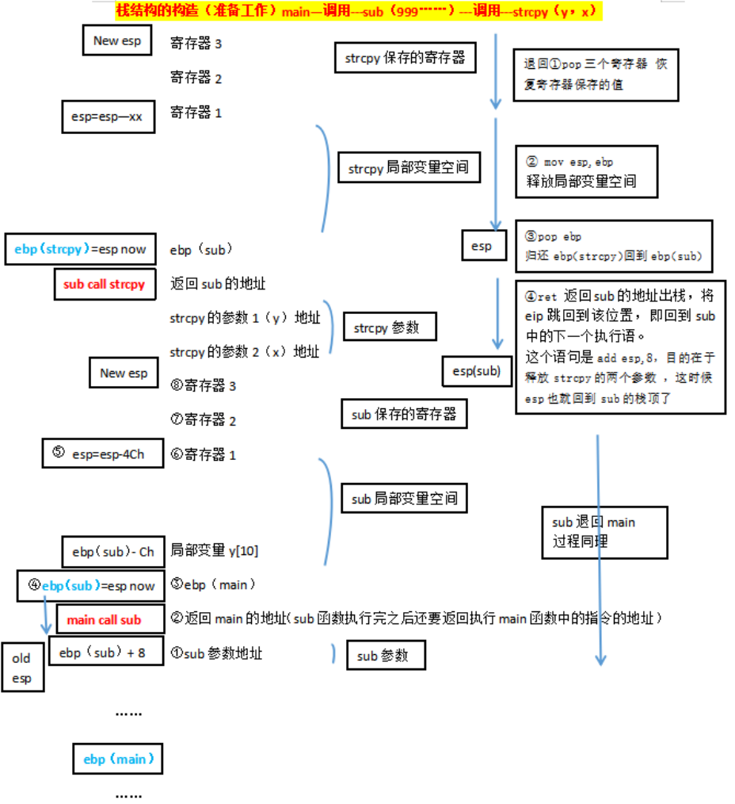
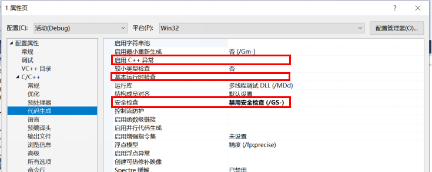
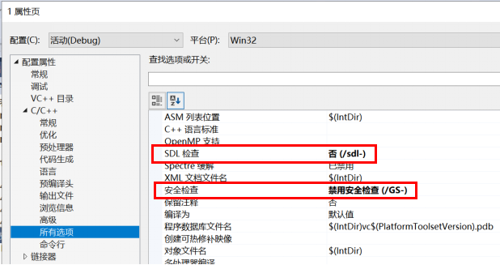
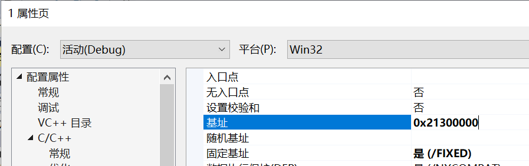
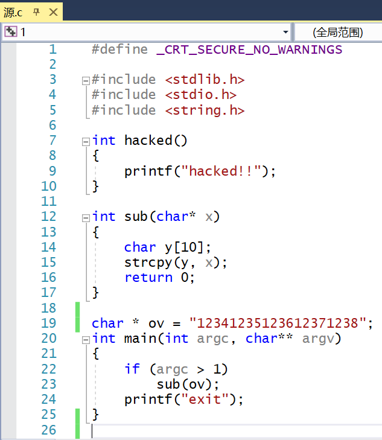
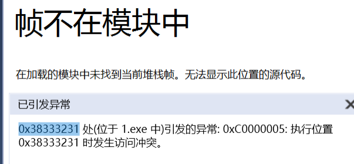
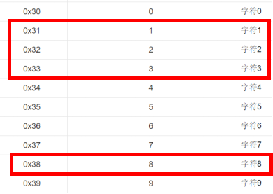
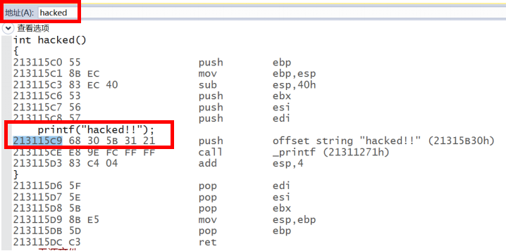
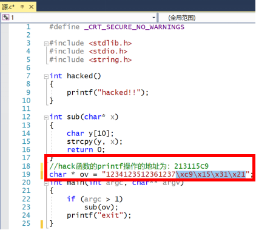
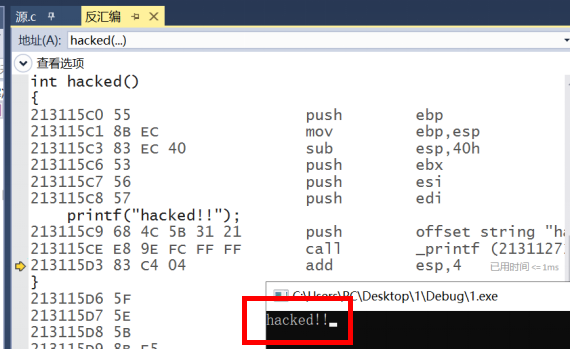

# 利用缓冲区(堆栈)溢出进行hacked函数攻击

## （一）对于函数调用以及栈结构构造的理解
* 程序执行过程中，线程使用栈形式的数据结构来保存和函数调用相关的数据，如函数调用的返回地址、主调函数的栈基址、局部变量和参数等。每次函数调用时，都会把以上数据按照一定的顺序入栈，函数返回时出栈，并且进行栈基址指针的改变。每次函数调用形成的新的栈的结构单元，称为栈帧，其实就是一个函数执行的环境：每个栈帧对应着一个未运行完的函数。栈帧中保存了该函数的返回地址和局部变量。
    

## (二)实验
* 栈中保存了函数调用时的返回地址，缓冲区溢出的目的就是要将栈中保存的返回地址篡改成成溢出的数据，这样就间接修改了函数的返回地址，当函数返回时，就能跳转到预设的地址中，执行植入的代码。
* 为了看到实验效果 准备工作 设置visual studio 项目属性      
         
         
  
* 函数源代码
  * 实验目的就是实现：在不调用hacked()函数的基础上，进入hacked()函数，并输出“hacked！”字符串
  * 设置sub()的参数是"12341235123612371238"
  
* 直接运行代码，会报以下错误
  * 这是由于在sub函数中，将长度很长的字符串x赋给了仅有10字节空间的y，导致溢出，覆盖了sub函数返回main函数的返回地址，详细的分析见实验二的md说明  
  * 此时返回地址变成了“0x38333231”      
       
* 查阅AscII码表，发现0x38333231对应的十进制是“1238”  
  * 由此可知，源代码中ov字符串的“1238”位置是返回地址对应的位置
  * 那么只要将目标hacked()函数的地址填写在“1238”对应的位置，那么sub函数运行完就会跳转进入hacked()函数     
  
* 为了防止每次hacked()函数的地址都不同，所以在最初准备工作中设置了基址，确保每次函数地址不变
  * 此时每次hacked()函数中的printf函数地址都是固定的，是0x213115c9
    
* 此时更改源代码的ov字符串，用0x213115c9代替1238的位置
  
* 再次运行，发现成功跳入了hacked()函数，输出了“hacked！”字符串
  
* 利用溢出的攻击实验成功