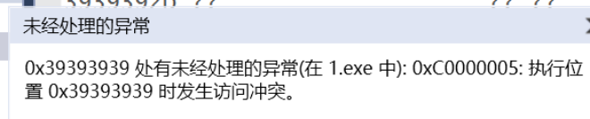

# 栈结构的构造(栈帧) & 缓冲区溢出安全问题分析

## （一）对于函数调用以及栈结构构造的理解
* 在函数调用时，首先进行的是参数传递的工作，有几个参数就进行几次push，我们把这个过程叫参数压栈，其中esp永远是栈顶指针  
  （压栈的顺序是反的，从最后一个参数开始压栈，最后栈中离ebp最近的是第一个参数）    
* 在完成参数压栈之后，马上进行call指令执行。call指令会把它的下一条指令的地址入栈（即返回地址入栈），并跳转到被调用函数 的内部执行      
* 函数一开始的代码都是在进行栈结构的构造。
  * 保留旧的ebp（主调函数的ebp入栈）
  * 把当前栈顶esp的位置作为新的ebp                  
  * 进行局部变量的内存空间开辟（通过移动栈顶esp，例如esp-4Ch）
  * 可能保留一些寄存器（上一个函数在用，这个函数也要用，所以要先把内容保留，类似“另存为”）
* esp可能变化很多次，但是ebp只变化一次。    
  * 不管当前的栈的绝对地址是多少（因为每次函数执行，绝对地址并不可预期），局部变量和参数相对于ebp的位置是固定的。
  * 保证了各个函数的独立性。才能实现不同的时间不同人编写的代码之间的相互可调用。  
* 随着函数的调用，栈在增长，调用完之后，栈在回退，回退到调用发生之时的那个位置（也就是参数压栈之前的位置）。        
  <table><tr><td bgcolor=yellow >【小结】程序执行过程中，线程使用栈形式的数据结构来保存和函数调用相关的数据，如函数调用的返回地址、主调函数的栈基址、局部变量和参数等。每次函数调用时，都会把以上数据按照一定的顺序入栈，函数返回时出栈，并且进行栈基址指针的改变。每次函数调用形成的新的栈的结构单元，称为栈帧，其实就是一个函数执行的环境：每个栈帧对应着一个未运行完的函数。栈帧中保存了该函数的返回地址和局部变量。
  </td></tr></table>

## (二)通过实验验证&理解
* 实验代码    
  本代码基本结构是 main(int,char**)---调用sub(char*)---调用strcpy(char*,char*)      
      
* 观察反汇编     
  * main对sub函数进行调用前要现将sub需要的参数push入栈     
    在push之前 栈顶数据如下图所示    
      
    在参数push入栈之后 栈顶数据如下图所示 （并观察到栈顶地址在减小）        
    入栈的是edx寄存器中存储的地址，在内存中观察这个地址，发现存储的是我们设置的参数“99999999999999999999999999999999999999999999999999”     
       
       
        
  * 完成参数压栈之后，马上进行call指令执行     
    观察到新入站了一个地址，且这个地址是main函数中call调用sub之后的下一条指令地址        
         
         
  * 进入sub函数内部之后，还要继续对栈进行构造        
    * 观察到将main函数的ebp入了栈    
    * 将当前栈顶esp的值赋给了ebp       
    * 将esp减了一个值（4ch），为栈分配了空间，供局部变量使用          
    * 保留了一些寄存器         
        
  * 在sub函数内用main调用sub的同样形式调用strcpy函数            
    * 将strcpy(y,x)函数需要的两个参数push入栈 （参数循序反着push，先push x，再push y）    
    * call调用已经进入strcpy函数后的构造和之前同理    
    * 调用结束后，eip回到sub函数的 地址为00541676的位置       
      通过esp+8释放为strcpy函数分配的两个参数          
         
  * 要完全从sub退回main函数，还需要以下操作（strcpy退回sub函数同理）     
    * pop三个寄存器 恢复寄存器保存的值   
    * mov esp,ebp 释放sub函数局部变量空间   
    * pop ebp 归还ebp（sub）回到ebp（main）  
    * ret 返回main的地址出栈，将eip跳回到该位置，即回到main中的下一个执行语。这个语句是add esp,4，目的在于释放sub的那一个参数，这时候esp也就回到main的栈顶了    
         
       

    
## (三)画图分析 增强理解    
    

## (四)安全性问题
* 为了看到实验效果 准备工作 设置visual studio 项目属性      
        
      
* 在本实验中设置的sub函数的参数x的值是99999999999999999999999999999999999999999999999999     
* 在栈帧中为sub的局部变量y[10]仅分配了Ch的空间           
* 进行strcpy(y,x)，相当于将x的值拷贝到局部变量y       
* 这时局部变量y的值会在 ebp(sub)-Ch 处开始放置        
* 结果就是sub栈帧中的ebp（main）和返回到main的地址等都被覆盖了        
  * 本身当进入sub函数，进行完ebp入栈时，栈帧的情况是这样的       
    栈帧中入栈了返回地址004e15d3 和 ebp(main)地址 010ffcf0     
        
      
  * 当strcpy计算结束,退回sub的栈帧后，可以看到栈帧的情况是这样的    
      
* 所以在这种情况下，程序无法退回到main函数，会将ebp赋值为39393939并尝试执行0x39393939处的代码，会错误终止。  
    