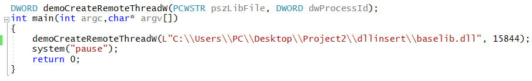

# DLL注入

### 实验要求
* 查文档，研究远程线程方式注入dll的实例代码的实现原理。   
* 运行实例代码，向一个目标程序（比如notepad.exe)注入一个我们自行编写的dll，加载运行。    
* 整合进程遍历的程序，使得攻击程序可以自己遍历进程得到目标程序的pid。    

### 实验过程
* 查文档，研究远程线程方式注入dll的实例代码的实现原理     
  * DLL注入步骤       
         
    * OpenProcess获得要注入进程的句柄   
    * VirtualAllocEx在远程进程中开辟出一段内存，长度为strlen(dllname)+1;   
    * WriteProcessMemory将Dll的名字写入第二步开辟出的内存中。  
    * GetProcAddress得到Kernel32函数（在LoadLibraryW中）的实际地址。   
    * CreateRemoteThread将LoadLibraryW作为线程函数，参数为Dll的名称，即"baselib.dll"（绝对路径），创建新线程  
    * WaitForSingleObject等待对象句柄返回  
    * CloseHandle关闭线程句柄  
  * 想要注入的baselib.dll  
    * 加载了准备好的DLL（修改函数入口代码）， DLL被加载时我们可以在DLLMain中指定要执行的代码。     
    
* 运行实例代码，向一个目标程序（比如notepad.exe)注入一个我们自行编写的dll，加载运行     
  * 主函数逻辑      
    其中传入的demoCreateRemoteThreadW函数的参数     
    * 第一个参数为baselib.dll的绝对地址    
    * 第二个参数为目标的将要被注入的程序的pid（资源管理器中可以查到PID）           
         
  * 运行结果     
    * 可以观察到在程序执行到CreateRemoteThread函数时，弹出MessageBox，符合baselib.dll中函数的应有结果      
    
    * 由Process Explorer工具可以查找到此时baselib.dll确实注入到notepad.exe中了      
    
* 整合进程遍历的程序，使得攻击程序可以自己遍历进程得到目标程序的pid     
  * 代码   
    将进程进行快照，循环进行依次遍历    
    若进程名为"notepad.exe"，则执行注入       
         
  * 此时运行就仅需要提前打开notepad.exe，不用特意去查对应的PID了
  * 结果和之前相同
  * 若打开两个notepad.exe，则同理出现两次注入两个notepad.exe，结果和之前相同  
           
      
  * 注入成功！

### 实验的坑
* 要在32位的exe中注入32位的dll！！！
  * notepad.exe默认是64位的，要去C:\Windows\SysWOW64 路径下打开32位的notepad.exe
* 注入完之后，要想重复运行，要先关掉notepad，再重新打开才能复现
* baselib.dll要在base.c有dllmain的情况下生成
* 路径要使用绝对路径，不然notepad.exe找不到我们baselib.dll的位置

### 参考文献
* fdiskyou/injectAllTheThings https://github.com/fdiskyou/injectAllTheThings
* CreateRemoteThread function https://docs.microsoft.com/zh-cn/windows/win32/api/processthreadsapi/nf-processthreadsapi-createremotethread?redirectedfrom=MSDN
* Dll注入经典方法完整版 https://blog.csdn.net/tiandyoin/article/details/79632601
* Taking a Snapshot and Viewing Processes https://docs.microsoft.com/zh-cn/windows/win32/toolhelp/taking-a-snapshot-and-viewing-processes