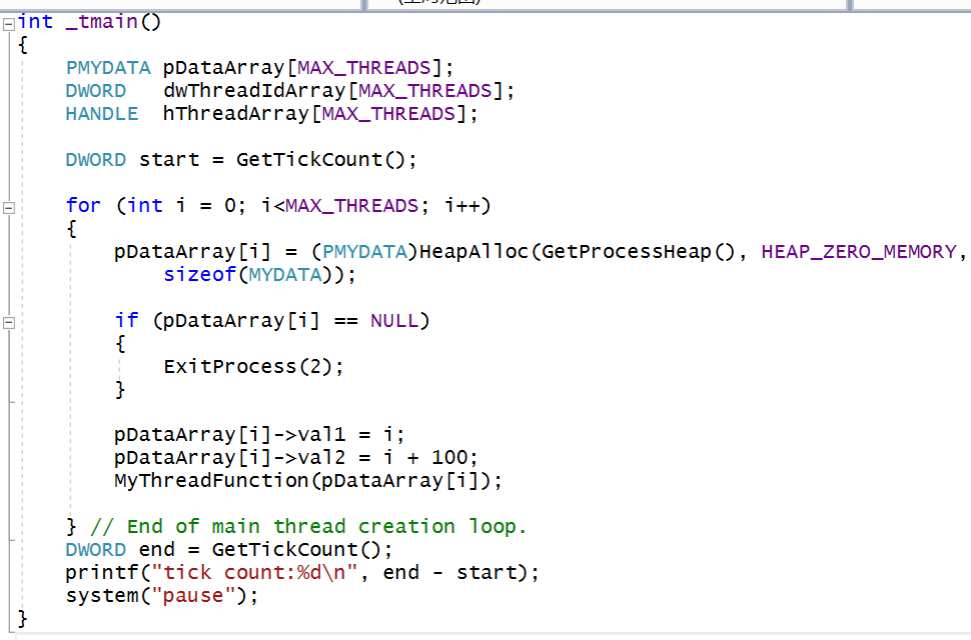
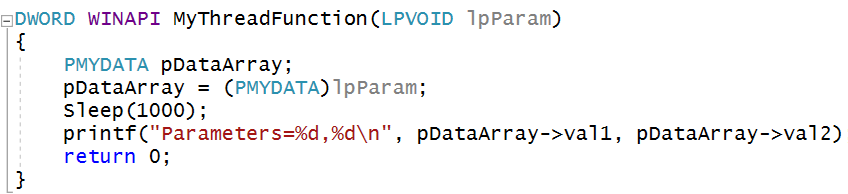
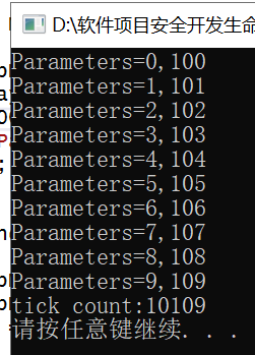
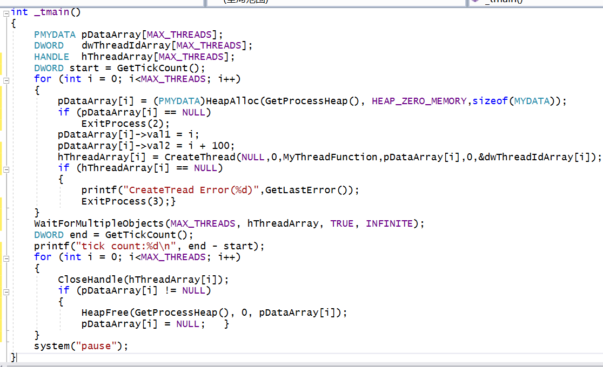
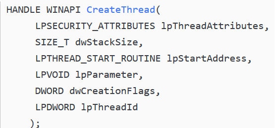
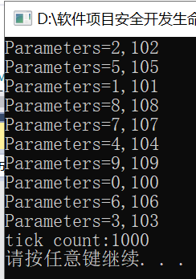

# 单线程vs多线程 实验

## 基础知识
* 程序、进程、线程
  * 程序：由源代码生成的可执行应用。
  * 进程：一个正在运行的程序可以看做一个进程，进程拥有独立运行所需要的全部资源
  * 线程：程序中独立运行的代码段。
  * 一个进程是由一或多个线程组成，进程只负责资源的调度和分配，线程才是程序真正的执行单元，负责代码的执行。
* 单线程
  * 每个正在运行的程序（即进程），至少包括一个线程，这个线程叫主线程
  * 主线程在程序启动时被创建，用于执行main函数
  * 只有一个主线程的程序，称作单线程程序
  * 主线程负责执行程序的所有代码。这些代码只能顺序执行，无法并发执行
* 多线程
  * 拥有多个线程的程序，称作多线程程序。
  * 相对于主线程来讲，其他线程，称为子线程
  * 子线程和主线程都是独立的运行单元，各自的执行互不影响，因此能够并发执行
* 单线程、多线程的区别
  * 单线程程序：只有一个线程，代码顺序执行，容易出现代码阻塞（页面假死）
  * 多线程程序：有多个线程，线程间独立运行，能有效地避免代码阻塞，并且提高程序的运行性能，但要占据更多的空间

## 实验
* 单线程
  * 代码  (#define MAX_THREADS 10)
       
    
  * 理解
    * HeapAlloc是一个Windows API函数。它用来在指定的堆上分配内存，并且分配后的内存不可移动。
    * GetProcessHeap用以获取和调用进程的堆句柄.
    * pDataArray[i] = (PMYDATA)HeapAlloc(GetProcessHeap(), HEAP_ZERO_MEMORY,sizeof(MYDATA));即在堆内存上申请了一个不可移动的空间，大小为sizeof(MYDATA).
  * 运行结果 
    * 10个线程按顺序创建，按顺序调度   
    

* 多线程
  * 代码  (#define MAX_THREADS 10)
    
    
  * 理解  
    * 调用API:CreateThread可以创建一个新线程
      
      * lpThreadAttributes 默认安全属性时传入NULL
      * dwStackSize 用于指定线程初始时的栈大小，通常传入0即可，此时系统会使用一个合适的大小
      * lpStartAddress 就是新线程入口函数的地址
      * lpParameter 就是传入线程入口的参数，这个参数完全由调用者使用，系统只是简单的将这个参数传递给线程函数，并不做别的任何处理
      * dwCreationFlags 指出创建线程的方式，如果是0，表示线程一被创建就被立即执行
      * lpThreadId 则用于得到线程唯一的标识符
    * WaitForMultipleObjects 等待所有线程终止
  * 运行结果     
    * 10个线程是按顺序创建的，但线程的调度是随机的      
    
